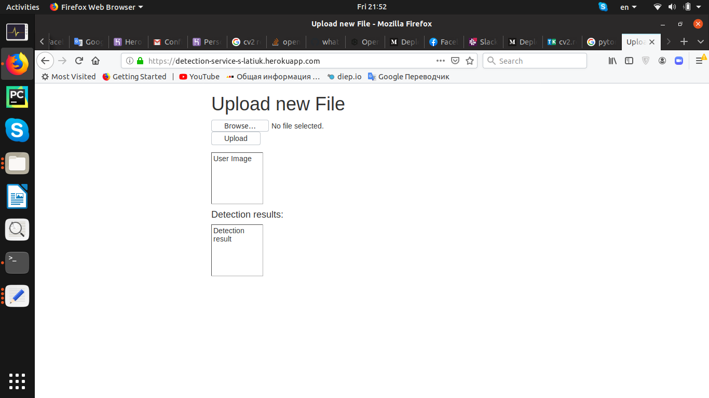
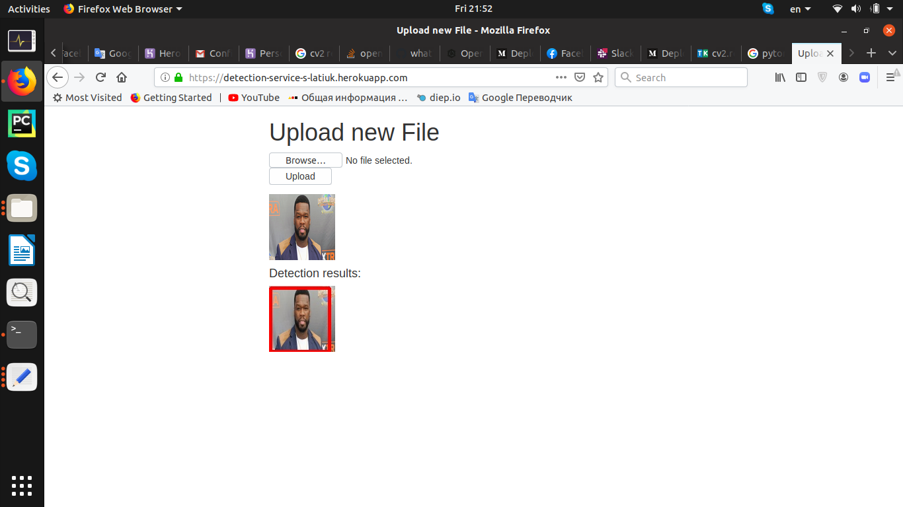

# Detection-service (c)
Detection service.  
Detects different objects on images.

(This project originally was a homework for DL School MIPT Part1 Spring 2020)

1. Framework for detection: torchvision.models.detection
2. Results of running chosen detector on random images you can see in app/static/output-images
3. Framework for developing web-demo: Flask
4. app/frontend.py
5. app/detector.py
6. app/static/output-images. Detector works pretty good, I don't know how to improve it significantly
7. Added bootstrap. Deployed to heroku (https://detection-service-s-latiuk.herokuapp.com) but it works without crash only for one run due to memory issues (don't know how to fix). 

# How to run it?
At first, download this repo, for example, exucute this in a shell:  

<code>git clone https://github.com/GreyCoder25/Detection-service</code>

After unpacking, cd to /Detection-service folder and run the script:  

<code>python3 run.py</code>

The application will be available on 127.0.0.1:5000 in any browser.
